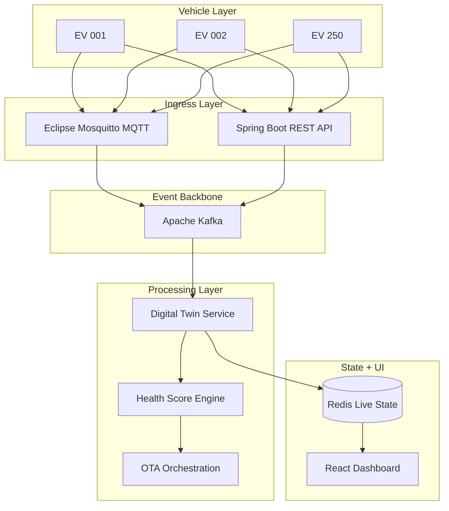

# 01 — Project Summary: Axion EV Fleet Management

## What Axion Is
Axion is an EV fleet management platform that treats each vehicle as a continuously updated digital asset instead of a passive record in a database. The system ingests telemetry from simulated vehicles, transforms it into a canonical format, computes a health score, and exposes the latest state through a real-time dashboard.

The project is built around a simple idea: fleet operators should not have to read raw telemetry logs to understand what is happening. They should be able to look at one dashboard and immediately see which vehicles are healthy, which ones are degrading, which ones are offline, and which ones are safe to update.

---

## Why This Project Exists
Modern EV fleets have more moving parts than traditional vehicle fleets. Operators need to track battery health, temperature, connectivity, software version, update readiness, and overall fleet behavior at the same time. A basic location tracker is not enough, because it only tells you where a vehicle is. It does not tell you whether the vehicle can safely finish the route, whether it is overheating, or whether it should receive an OTA update right now.

Axion was designed to fill that gap. It combines simulation, event streaming, state caching, and a visualization layer so the whole telemetry lifecycle can be demonstrated end to end.

---

## Core Problem Statement
If a fleet operator manages hundreds or thousands of EVs, several questions become urgent:

1. Which vehicles have enough battery to complete the route?
2. Which vehicles are showing early signs of battery or thermal degradation?
3. Which vehicles are currently offline because of connectivity loss?
4. Which vehicles are safe to receive an OTA update?
5. How do we keep the dashboard responsive when data is constantly changing?

Axion answers those questions by pairing a backend event pipeline with a fast frontend that always reads the latest cached state.

---

## Basic Definitions

| Term | Simple Definition |
|---|---|
| EV | Electric Vehicle, a vehicle powered by electric motors and batteries. |
| Telemetry | Data sent from a vehicle to the backend, such as battery level or temperature. |
| Digital Twin | A live virtual copy of a physical vehicle’s current state. |
| OTA | Over-the-Air; remote software update delivery to a vehicle. |
| Dashboard | The visual control screen where operators monitor fleet status. |
| Simulator | Software that generates fake but realistic vehicle behavior for testing. |

These are the core project words that come up most often in the architecture explanation.

---

## Real-World Analogy
You can think of Axion like a flight control system for electric vehicles. Instead of waiting for manual reports, the system continuously listens to the fleet, updates each vehicle’s digital twin, and shows a live operational view. That makes the platform much more useful for operational decision-making than a static CRUD application.

---

## Main Capabilities
Axion is able to:

- ingest telemetry from both REST and MQTT sources
- normalize vendor-specific payloads into one internal format
- compute an explainable health score from live sensor values
- store the latest digital twin state in Redis with TTL-based freshness control
- simulate OTA update flows with health-based safety checks
- present a rich dashboard with live fleet metrics and detailed vehicle views

---

## System Architecture
The project uses an event-driven architecture. That means telemetry does not go directly from the simulator to the UI. Instead, it moves through a pipeline of ingestion, event streaming, processing, state storage, and presentation.

This architecture matters because it separates concerns. Ingestion can stay focused on accepting data, processing can stay focused on calculations, Redis can stay focused on current state, and the dashboard can focus on visualization.

---

## Why Event-Driven Design Was Chosen
The platform uses an event-driven architecture because EV telemetry is continuous and time-sensitive. If every telemetry event had to go straight to the dashboard or directly into a database write path, the system would become harder to scale and harder to recover from failures.

Kafka gives the system a buffer. That means if a downstream consumer slows down temporarily, the incoming events are still preserved. This makes the platform more resilient than a simple request-response design.

---

## Comparison With Traditional Fleet Software

| Feature | Traditional Fleet Software | Axion |
|---|---|---|
| Data focus | Mostly GPS/location | Full telemetry and health context |
| Vehicle model | Static record | Live digital twin |
| Update flow | Manual or periodic | OTA with safety gating |
| Scalability | Limited by direct DB writes | Event-stream based and horizontally scalable |
| UI behavior | Refresh-heavy or stale | Polls fast cached state for live visibility |
| Diagnostics | Basic alerts | Explainable scoring and reason codes |

---

## Scope Of The Project
This is an academic but industry-shaped implementation. The current scope includes 250 simulated EVs, real-time telemetry ingestion, live state caching, OTA simulation, and a dashboard that can display the system in a way that feels production-like.

The design is intentionally scalable. If more vehicles were added, the system would scale primarily by increasing event partitions, consumers, and cache capacity rather than changing the core architecture.

---

## What To Emphasize In A Viva
If you are asked to explain the project quickly, say this:

Axion is an EV fleet management platform that combines a simulator, Spring Boot ingestion service, Kafka event streaming, Redis digital twins, and a React dashboard. Its main value is that it tracks live vehicle health, not just vehicle location, and it uses explainable scoring plus OTA safety checks to make the data actionable.
