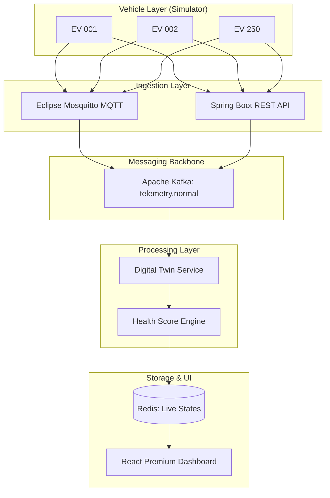

# 01 — Project Summary: Axion EV Fleet Management

## Mission & Goal
**Axion** is an industrial-grade, backend-first platform designed to manage the complexities of modern Electric Vehicle (EV) fleets. Unlike traditional fleet management tools that focus solely on GPS tracking, Axion treats every vehicle as a **"Digital Twin"**—a real-time virtual representation that mirrors the physical vehicle's health, battery state, and operational status.

The primary goal is to provide fleet operators with **actionable intelligence** rather than just raw data.

---

## Real-World Use Case
Imagine a logistics company like **DHL** or **Amazon** operating 500 electric delivery vans in a city. They face challenges like:
1.  **Range Anxiety**: Which vans have enough battery to finish their routes?
2.  **Battery Health**: Is a specific van's battery degrading too fast due to overheating?
3.  **Software Updates**: How do we update the firmware of 500 vans without bricking them or causing downtime?

**Axion solves this by:**
-   Monitoring 250+ vehicles in real-time.
-   Calculating an **Explainable Health Score** for every vehicle.
-   Orchestrating **Over-the-Air (OTA)** updates with safety gates (e.g., won't update if the battery is < 20%).

---

## System Architecture
Axion uses an **Event-Driven Architecture (EDA)**. Instead of the database being the center of the world, **Events** (telemetry data) flow through the system like blood through a body.

---

## Comparison with Existing Technology

| Feature | Traditional Fleet Management | **Axion Platform** |
| :--- | :--- | :--- |
| **Data Focus** | GPS & Location | **Full Telemetry** (SOC, Temp, Motor Health) |
| **Architecture** | Monolithic / Request-Response | **Event-Driven / Reactive** |
| **Vehicle State** | Database Snapshot | **Digital Twin** (Always-in-sync virtual model) |
| **Updates** | Periodic / Manual | **Orchestrated OTA** with safety logic |
| **Analysis** | Simple Alerts | **Explainable Health Scoring** |

---

## Project Scope (Academic vs. Industry)
-   **Current Scope**: Managing 250 simulated vehicles, real-time ingestion, Digital Twin state storage, and OTA simulation.
-   **Industry Alignment**: The architecture is designed to scale to thousands of vehicles by adding more Kafka partitions and Spring Boot instances.
