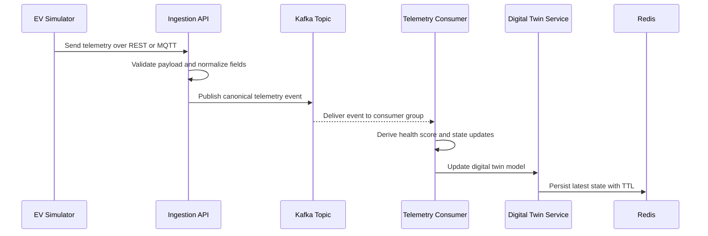

# 02 — Backend Deep Dive: Architecture & Tech Stack

The Axion backend is responsible for everything that happens after telemetry enters the system. Its job is to accept data, validate it, normalize it, publish it, consume it, compute derived state, and make that state available to the dashboard.

The backend is intentionally layered so each concern is isolated. That separation makes the system easier to debug and easier to explain in a viva.

---

## Basic Definitions

If you need a very simple explanation first, use this glossary:

| Term | Simple Definition |
|---|---|
| Kafka | A message streaming system that moves events from one service to another reliably. |
| Redis | An in-memory data store used here to keep the latest vehicle state very fast. |
| MQTT | A lightweight messaging protocol commonly used for IoT and device telemetry. |
| REST API | A web API style that uses HTTP requests like GET and POST. |
| Digital Twin | A live software copy of a physical vehicle’s current state. |
| TTL | Time To Live; the time before cached data expires automatically. |
| Canonical Model | One standard internal data format used after normalizing incoming payloads. |

These definitions are intentionally short so you can say them quickly in a viva before going into the deeper architecture explanation.

---

## Backend Responsibilities
The backend handles five core responsibilities:

1. Accept telemetry from REST and MQTT endpoints.
2. Validate the payload and convert it into a canonical internal model.
3. Push the canonical event into Kafka.
4. Consume Kafka events and update the digital twin in Redis.
5. Expose dashboard-friendly REST APIs that return fleet state and health information.

This means the backend is not just a storage layer. It is the central operational engine of the whole platform.

---

## Technology Choices

### Java 21 + Spring Boot 3.2
Java gives the backend strong typing, mature tooling, and long-term maintainability. Spring Boot simplifies the creation of production-style REST services and infrastructure integrations.

Why this stack fits Axion:

- it is stable and widely used in enterprise backend systems
- it integrates cleanly with Kafka and Redis
- it supports dependency injection, configuration management, and layered service design
- it maps well to the kind of architecture used in real telemetry systems

### Apache Kafka
Kafka is the event backbone of the backend. It is used to decouple ingestion from processing, which means the system does not depend on every downstream step being available at the exact moment telemetry arrives.

Why Kafka matters here:

- telemetry is continuous and high volume
- consumers can scale independently
- messages are preserved even if processing is temporarily delayed
- the system can be expanded later without rewriting the ingestion layer

### Redis 7.0
Redis acts as the live state store for the digital twin. The dashboard needs the freshest snapshot of each vehicle, not historical data, so Redis is a good fit because it is memory-backed and extremely fast.

Why Redis is used instead of a slower relational query path:

- the dashboard refreshes frequently
- the application needs sub-second response times
- digital twin state is naturally “current state” rather than “long-term report data”
- TTL support helps the system automatically mark stale vehicles as offline

### MQTT via Eclipse Mosquitto
MQTT is used because it is light, efficient, and designed for telemetry-style workloads. In IoT and vehicle settings, MQTT is often a better fit than sending every update via raw HTTP.

Why MQTT is included:

- it simulates a realistic vehicle-to-cloud messaging protocol
- it reduces transport overhead
- it demonstrates dual ingestion support in the project
- it is common in connected-device ecosystems

---

## Detailed Data Flow
The backend follows a strict pipeline so that every step is understandable and traceable.

The reason this flow is important is that it creates clear boundaries. Ingestion does not need to know how scoring works. Scoring does not need to know how the dashboard renders. The dashboard only needs the latest state, not the full message path.

---

## Key Backend Concepts

### 1. Adapter Pattern
Vehicle manufacturers can send payloads with different field names, structures, and units. The adapter layer converts those variations into one internal shape. This is what makes the backend vendor-neutral.

In practical terms, this means:

- incoming data can vary in shape
- the rest of the backend can still use one consistent model
- the health engine and digital twin service do not need to understand vendor-specific formats

### 2. Canonical Telemetry Model
The canonical model is the internal contract used after normalization. It keeps the rest of the system stable even if incoming payloads change.

That gives the backend two advantages:

- easier validation, because everything is checked against one model
- easier debugging, because the downstream code sees consistent field names

### 3. Digital Twin Lifecycle
The `DigitalTwinService` stores the latest state of each vehicle and updates it whenever fresh telemetry arrives. It does not behave like a historical audit log. It behaves like a live operational mirror.

Important details:

- the latest timestamp wins
- stale updates are ignored
- each twin has a TTL so offline vehicles automatically age out of the live cache
- the service can infer whether a vehicle is active or offline from freshness

### 4. Explainable Health Scoring
The health engine produces more than just a score. It also produces the logic behind the score.

Why explainability matters:

- a score alone does not tell an operator what to fix
- reasons allow the dashboard to show why a vehicle is degraded
- explainability makes the score defensible in front of examiners because it shows rule-based reasoning rather than a black box

### 5. OTA Safety Gating
The backend also participates in OTA orchestration. Before an update is considered safe, the vehicle’s health and state can be checked to avoid updating a vehicle that is already unstable.

That means the backend is not only a data pipeline. It also acts as a decision layer for operational safety.

---

## Why This Backend Is Scalable
The backend is scalable because it uses stateless ingestion plus event streaming.

If traffic increases:

- more ingestion instances can be added
- Kafka partitions can be increased
- consumer instances can be scaled horizontally
- Redis can remain the fast source of live truth

This is the main architectural advantage over a direct request-response design that stores everything in a single synchronous database path.

---

## What To Say In A Viva
If asked to summarize the backend, say:

The backend receives telemetry through REST and MQTT, normalizes it into a canonical model, publishes it to Kafka, consumes it to update the digital twin in Redis, and calculates an explainable health score for every vehicle. The architecture is event-driven so the ingestion and processing paths remain loosely coupled and scalable.
