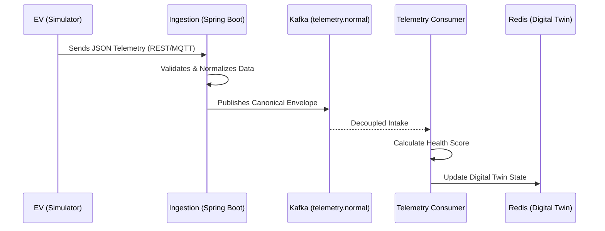

# 02 — Backend Deep Dive: Architecture & Tech Stack

The Axion backend is built for **high-throughput ingestion** and **real-time state management**. It uses a "Cloud-Native" stack to ensure scalability and reliability.

---

## 🛠 Technology Definitions (What & Why?)

### 1. Java 21 & Spring Boot 3.2
*   **What**: Java is a robust, object-oriented programming language. Spring Boot is a framework that makes it easy to create stand-alone, production-grade Spring-based Applications.
*   **Why**: We used **Java 21** for its modern features (like Virtual Threads) and **Spring Boot** for its massive ecosystem. It handles dependency injection, REST APIs, and integration with Kafka/Redis out of the box.

### 2. Apache Kafka
*   **What**: A distributed event store and stream-processing platform. Think of it as a "super-powered postal service" that can handle millions of messages per second.
*   **Why**: In an EV fleet, telemetry data is a continuous stream. Kafka allows us to "decouple" the ingestion (taking data from cars) from the processing (calculating health). If the processing service goes down, Kafka holds the messages so we don't lose any data.

### 3. Redis 7.0
*   **What**: An in-memory data structure store, used as a database, cache, and message broker. It is incredibly fast because it stores everything in RAM.
*   **Why**: We use Redis for our **Digital Twin** state. Since the dashboard needs to show the latest state of 250 vehicles every 3-5 seconds, querying a traditional SQL database would be too slow. Redis gives us sub-millisecond access to the "Live State."

### 4. MQTT (Eclipse Mosquitto)
*   **What**: Message Queuing Telemetry Transport. It's a lightweight messaging protocol designed for "Internet of Things" (IoT) devices with limited bandwidth.
*   **Why**: Real EVs don't use REST APIs to send data because HTTP headers are too "heavy." MQTT is the industry standard for vehicle-to-cloud communication.

---

## 🔄 The Data Pipeline (Data Flow)

The backend follows a strict pipeline to ensure data integrity:

---

## 🧠 Key Backend Concepts

### 1. Adapter Pattern (Vendor Neutrality)
Different EV manufacturers (Tesla, MG, Tata) might send data in different JSON formats. We use an **Adapter Pattern** to convert these varied formats into a single **CanonicalTelemetryEnvelope**. This makes the rest of the system "vendor-neutral."

### 2. Digital Twin Engine
The `DigitalTwinService` manages the lifecycle of a vehicle's virtual model.
-   **State Store**: Redis.
-   **TTL (Time To Live)**: We set a 120-second TTL. If a vehicle hasn't sent data for 2 minutes, it expires from Redis and is marked as **OFFLINE**.

### 3. Explainable Health Scoring
Every time telemetry arrives, the `HealthScoreEngine` runs a set of rules:
-   **Battery Rule**: If SOC < 10%, deduct 40 points.
-   **Thermal Rule**: If Battery Temp > 45°C, deduct 30 points.
-   **Explainability**: Instead of just giving a number (e.g., 65), the API returns the **reasons** for the score (e.g., "Critical battery level detected").
