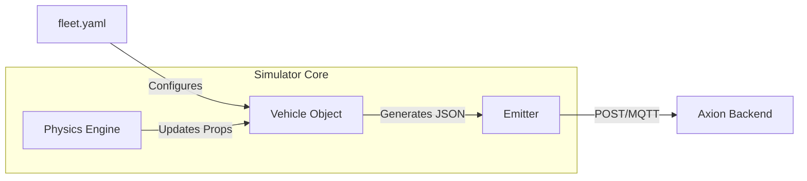

# 04 — Fleet Simulator: Driving 250 High-Fidelity EVs

The **Axion Simulator** is a critical component that mimics a real-world EV fleet. It provides the "stress test" for the backend by generating high volumes of telemetry.

---

## 🛠 Technology Stack (What & Why?)

### 1. Python 3.12 & `asyncio`
*   **What**: Python is a high-level programming language. `asyncio` is a library for writing single-threaded concurrent code using coroutines.
*   **Why**: Simulating 250 vehicles traditionally would require 250 "Threads," which would consume a lot of RAM. `asyncio` allows a single thread to manage all 250 vehicles efficiently by switching between them whenever they are waiting (e.g., waiting for a network response).

### 2. YAML (Fleet Configuration)
*   **What**: "Yet Another Markup Language"—a human-readable data serialization format.
*   **Why**: We use YAML to define our fleet. It's much easier to read and edit than JSON, allowing us to quickly change the number of vehicles or their profiles.

---

## 🏎 Vehicle Profiles
To make the simulation realistic, we don't treat every vehicle the same. We have different profiles:
-   **Sedan**: Standard battery depletion, average speed.
-   **Truck**: High energy consumption, slower acceleration, larger battery capacity.
-   **Sport**: Rapid acceleration, high thermal generation (gets hot quickly).

---

## ⚠️ Fault Injection Scenarios
What makes Axion "intelligent" is its ability to detect problems. The simulator can trigger **5 Scenarios** to test the system:

1.  **Normal Drive**: Standard telemetry; battery and temperature stay within safe ranges.
2.  **Battery Drain**: Simulates a faulty battery cell where SOC drops 5x faster than normal.
3.  **Thermal Spike**: Simulates a cooling system failure where the battery temperature rises rapidly.
4.  **Network Dropout**: Simulates a vehicle passing through a tunnel (loses connection) to test the Backend's OFFLINE detection.
5.  **OTA Trigger**: Prepares the vehicle to receive a simulated software update, allowing us to test the "Update State Machine."

---

## ⚙️ How it works (Internal Logic)

### 1. Physics Engine
Every "tick" (update interval), the simulator calculates new values based on the vehicle's state. If a vehicle is "Driving," its Speed increases, SOC decreases, and Temperature rises slightly.

### 2. Dual-Mode Emitter
The simulator can send data via **REST (HTTP)** or **MQTT**. This allows us to test both ingestion paths in the backend.

### 3. OTA State Machine
When an OTA update is triggered, the Python vehicle enters a special state:
`IDLE` → `PREPARING` → `DOWNLOADING` → `APPLYING` → `SUCCESS/FAILURE`
If the backend detects a health issue during this cycle, it can send a "Cancel" command to the simulator.
