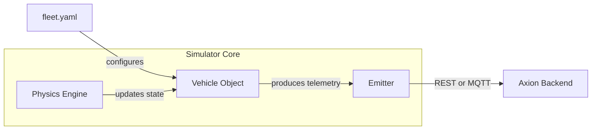

# 04 — Fleet Simulator: Driving 250 High-Fidelity EVs

The simulator is the data generator for the whole system. Without it, the backend would have nothing to process and the dashboard would have nothing interesting to show.

Its main job is to behave like a realistic fleet of EVs, not just to emit random numbers. That means the simulator tracks vehicle state over time, changes values gradually, and can also inject controlled faults to test the backend and dashboard.

---

## Why the Simulator Matters
In a real system, you rarely get perfect telemetry. Vehicles move, charge, disconnect, overheat, and receive software updates. The simulator exists to reproduce those patterns in a controlled way so the backend logic can be exercised under realistic conditions.

This makes it useful for:

- demonstrating end-to-end telemetry flow
- testing digital twin freshness logic
- validating health scoring under changing conditions
- proving that offline detection works
- showing how OTA scenarios would behave in production

---

## Technology Choices

### Python 3.12
Python is a good choice for a simulator because it is readable, quick to prototype, and excellent for event-driven and asynchronous workloads.

### asyncio
The simulator uses asynchronous concurrency so it can manage many vehicles without assigning each one a full operating-system thread.

Why that is important:

- 250 real threads would be memory-heavy and unnecessary
- async coroutines can share a single event loop efficiently
- each vehicle can pause, wait, and resume without blocking the others

### YAML Configuration
The fleet is described in YAML because fleet configuration is easier to read and edit in that format than in large hand-written JSON blobs.

The YAML config allows the simulation to define:

- how many vehicles exist
- which profiles they use
- what scenario each vehicle runs
- how often telemetry is emitted

---

## Vehicle Profiles
The simulator is not flat. Different vehicles behave differently, which makes the data more realistic.

### Sedan
A sedan profile behaves like a normal road vehicle. It has balanced speed, moderate battery drain, and typical temperature changes.

### Truck
A truck profile usually consumes more energy and may have slower acceleration because it is heavier. That makes it useful for testing higher-load cases.

### Sport
A sport profile is more aggressive. It can accelerate faster and generate more heat, which makes it useful for thermal and high-demand scenarios.

Using multiple profiles makes the system more believable because a real fleet is never identical across all vehicles.

---

## Fault Injection Scenarios
The simulator is also a testing tool. It can intentionally create abnormal conditions so the backend’s logic can be validated.

### 1. Normal Drive
This is the baseline scenario. The vehicle behaves normally, telemetry changes gradually, and the backend should treat it as healthy.

### 2. Battery Drain
This scenario simulates a battery that is degrading or consuming power unusually fast.

Why it is useful:

- it verifies the health engine’s SOC threshold logic
- it tests whether the dashboard highlights risk correctly
- it shows how the system reacts to a low-range condition

### 3. Thermal Spike
This scenario simulates a vehicle heating up too quickly.

Why it is useful:

- it checks whether temperature rules are being applied
- it demonstrates how thermal faults can affect health scoring
- it gives the dashboard a concrete warning case

### 4. Network Dropout
This simulates a vehicle losing connectivity, like when it drives through a tunnel or a dead zone.

Why it is useful:

- it validates offline detection
- it tests whether Redis TTL expiry and stale-state handling work correctly
- it shows the difference between an active vehicle and one that simply stopped reporting

### 5. OTA Trigger
This prepares the vehicle for an update simulation.

Why it is useful:

- it demonstrates the update lifecycle
- it shows how the backend can gate updates based on health
- it gives you a story for safe rollout and failure handling

---

## Internal Working Model

The simulator loop is conceptually simple:

1. load the fleet and scenario configuration
2. create one in-memory object per vehicle
3. update each vehicle’s state on every tick
4. turn the new state into a telemetry payload
5. send the payload through the configured emitter

---

## Physics Engine Concept
The simulator’s physics layer changes vehicle values over time. For example:

- if the vehicle is driving, speed increases or varies
- SOC decreases as the vehicle consumes energy
- battery temperature rises under load
- connection state may change depending on the scenario

This matters because a good simulator should not produce static or random values. It should produce coherent state transitions that the backend can reason about.

---

## Dual-Mode Emitter
The simulator can send data using REST or MQTT.

This is important because it proves that the backend is protocol-flexible. The project can therefore demonstrate both a web-style ingestion path and an IoT-style ingestion path.

---

## OTA State Machine
When OTA is triggered, the vehicle moves through a lifecycle such as:

`IDLE` → `PREPARING` → `DOWNLOADING` → `APPLYING` → `SUCCESS` / `FAILURE`

This is a very viva-friendly concept because it shows state progression. It also connects directly to the backend’s safety gating logic.

---

## What To Say In A Viva
If asked about the simulator, say:

The simulator is written in Python using asyncio so 250 vehicle objects can run concurrently without heavy threading overhead. It reads YAML configuration, simulates realistic vehicle profiles, supports multiple fault scenarios, and can emit telemetry through REST or MQTT to test the backend pipeline.
